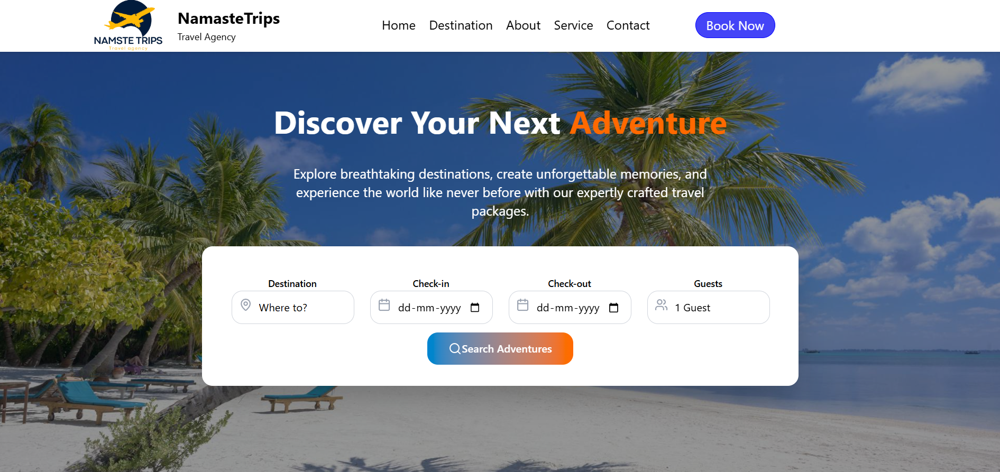

#  NamasteTrips – Travel Website

[](http://NamasteTrips.surge.sh)

NamasteTrips is a responsive **travel website** built with **ReactJS** that helps users explore destinations, view services, and plan trips — all with a clean and minimal UI.

---

## 🚀 Features

- **Responsive Design** – Fully mobile-friendly layout using **Tailwind CSS**.
- **Modern UI Components** – Built with **React-Bootstrap** and **Material-UI**.
- **Interactive Icons** – Used **Lucide React Icons** for a beautiful look.
- **Smooth Navigation** – Implemented with **React Router**.
- **Deployed on Surge** – Easily accessible via [NamasteTrips.surge.sh](http://NamasteTrips.surge.sh).

---

## 🛠️ Tech Stack

- **Frontend:** ReactJS, Tailwind CSS, React-Bootstrap, Material-UI  
- **Icons:** Lucide React  
- **Routing:** React Router DOM  
- **Deployment:** Surge.sh  

---

## 📸 Screenshots

### 🏠 Homepage


### ✈️ Destinations


### 🎥 Footer & Extra Features


---

## 🏃 Getting Started (Run Locally)

Clone the repository and install dependencies:

```bash
git clone https://github.com/Akshay1737/NamsteTrips-ReactJs.git
cd NamsteTrips-ReactJs
npm install
npm run dev
